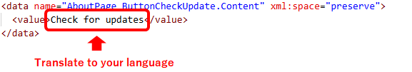
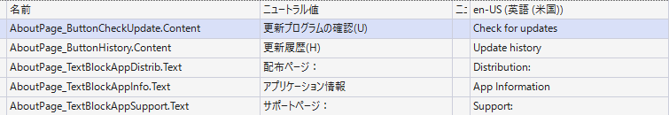

# Welcome

Welcome to the "Nicokara Karaoke Video Maker 3" translation page.

Thank you for your interest in contributing to translation.

## How to translate

The translation process involves three steps.

1. Fork (Copy files to your GitHub account)
1. Edit
1. Pull request (Reflect your edits)

## Step 1: Fork

This step will create a copy of this repository (whole files) for you to work with.

Please click the fork button on this page. A copy of this repository will be created in your GitHub account.

> \[!NOTE]
> For more information about forking, please see the [GitHub documentation](https://docs.github.com/en/pull-requests/collaborating-with-pull-requests/working-with-forks/fork-a-repo).

## Step 2: Edit

You can edit files online or on your PC.

[Online editing](https://docs.github.com/en/repositories/working-with-files/managing-files/editing-files) is convenient, but it may have fewer features.

If you're editing on your PC, [download (clone) the forked repository](https://docs.github.com/en/repositories/creating-and-managing-repositories/cloning-a-repository), edit it, and then upload it after you've finished editing.

### New language

If a folder for your language does not already exist, create a new one.

Please use folder names according to BCP47 language-region (e.g. de-DE).

Copy "en-US/Resources.resw" to the folder you created.

> \[!NOTE]
> If you are having trouble creating folders or copying files during online editing, please request creation on "Discussions
" page.
> When doing so, please specify your desired BCP47 language-region.

### Edit

Edit the "Resources.resw" file for your language. Do not modify "Resources.resw" files ​​other than your language.

"Resources.resw" is an XML file, so you can edit it with a text editor.

The `data name` indicates where the translation will be displayed. Do not change the `data name`.

The text between `<value>` and `</value>` is the translation. Please translate this into your language.

[Visual Studio 2026](https://visualstudio.microsoft.com/) makes editing easier because it can display multiple resw files in a matrix format.

## Step 3: Pull request

A pull request is a way to propose the original project (this repository) to incorporate your changes.

> \[!NOTE]
> For instructions on how to submit a pull request, please see the [GitHub documentation](https://docs.github.com/en/pull-requests/collaborating-with-pull-requests/proposing-changes-to-your-work-with-pull-requests/creating-a-pull-request-from-a-fork).

The project owner will review the pull request and, if there are no issues, will reflect the changes in the original project.

## After translation

The next version of Nicokara Karaoke Video Maker 3 will include translations.

We will list the translator's name here.

## Contributors

- en-US
  - SHINTA
